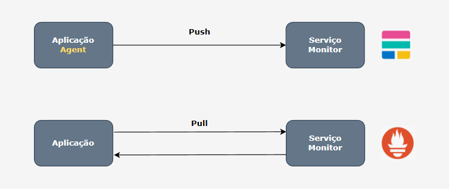

# Observabilidade

## Introdução

- Aula 1: Introdução

- Aula 2: O que é realmente Observabilidade
    - Na teoria de controle, a observabilidade é definida como uma medida de quão bem os estados internos de um sistema podem ser inferidos a partir do conhecimento das saídas externas desse sistema. Simplificando, observabilidade é quão bem você pode entender seu sistema complexo.

- Aula 3: Observabilidade Vs Monitoramento
    - Monitoramento nos mostra que há algo errado
    - Monitoramento se baseia em saber com antecedência quais sinais você deseja monitorar
    - Observabilidade nos permite perguntar o porquê

- Aula 4: Os 3 pilares da Observabilidades
    - Métricas
    - Logs
    - Tracing
    

## Elastic Stack

- Aula 5: Introdução ao Elastic Stack
    - Voltando no tempo: Era conhecido como ELK Stack
        - Elastisearch: Search engine e analytics
        - Logstash: Processador de dados através de pipelines que consegue receber, transformar e enviar dados simultaneamente
        - Kibana: Permite usuários a visualizarem os dados do elasticsearch em diversas perspectivas
    - Elastisearch
        
        - Search engine e analytics
        - Apache Lucene
        - 2010: Elasticsearch N.V (Elastic)
        - Rápido
        - Escalável
        - API Rest
        - Análise e visualização geoespacial
        - Application, website e enterprise search
        - Logging e analytics
        - Trabalha de forma distribuída através de shards que possuem redundância de dados.
        - Pode escalar milhares de servidores e manipular petabytes de dados

- Aula 6: Mais sobre Logstash
    - Logstash
        
        - Engine coletora de dados em tempo real
        - Iniciou como manipulador de logs
        - Trabalha com pipelines
        - Recebe dados de múltiplas fontes
        - Normaliza e transforma dados
        - Envia dados para múltiplas fontes
        - Plugins

- Aula 7: Sobre o Kibana
    - Kibana
        
        - Ferramenta de visualização e exploração de dados
        - Usada com: Logs, Análise de séries, Monitoramento de aplicações e inteligência operacional
        - Integrado com Elasticsearch
        - Agregadores e filtragem de dados
        - Dashboards
        - Gráficos interativos
        - Mapas

- Aula 8: Beats e Elastic Stack
    - Qual a diferença entre ELK Stack e Elastic Stack?
        Beats
        
        - Beats foi anunciado em 2015
        - "Lightweight data shipper"
        - Agente Coletor de dados
        - Integrado facilmente com Elasticsearch ou Logstash
        - Logs, Métricas, Network data, Audit Data, Uptime Monitoring
        - Você pode contruir seu próprio Beat
        Elastic Stack
        
        Elastic
        - Empresa por trás das soluções
        - Cloud Solution
        - Oferecem plugins e recursos licenciados
        - Produtos
            - APM
            - Maps
            - Site Search
            - Enterprise Search
            - App Search
            - Infrastructure
    
- Aula 9: Iniciando com Elasticsearch e Kibana
    - Site da elastic <https://www.elastic.co/pt/>
    - Github elastic <https://github.com/elastic>
    - Copiando o dockercompose do repositório
    ```
    docker-compose up -d
    ```
    ```
    http://localhost:5601
    ```
    - Estou utilizando a versão 7.13.0 igual a do curso para poder seguir. Os comandos abaixo foram tentativas de instalação das novas versões (8.0)
        - Irá pedir um token, para isso precisa rodar o seguinte comando:
        ```
        docker exec -it elasticsearch /usr/share/elasticsearch/bin/elasticsearch-create-enrollment-token -s kibana
        ```
        ``` 
        docker exec kibana kibana-verification-code
        ```

- Aula 10: Visão geral do Kibana
    - Mostrou um pouco da ferramentas e algumas abas de onde iremos trabalhar.

- Aula 11: Metricbeat
    - Criando o arquivo metricbeats.yaml
    - Inserindo o metricbeat dentro do docker-compose
    ```
    docker-compose up -d
    ```
    - Adicionada a seguinte linha no arquivo docker-compose devido a um erro de permissão no arquivo do metricbeat.
    ```
    command: ["--strict.perms=false"]
    ```
    - Visualizando as primeiras métricas e Dashboards

- Aula 12: Uptime e Heartbeat
    - Criando o arquivo heatbeat.yaml
    ```
    docker-compose up -d
    ```
    - Inserida a mesma linha de permissão que foi colocada no arquivo do metricbeat também dentro do heartbeat.
    ```
    command: ["--strict.perms=false"]
    ```
    - Verificando a aba Uptime

- Aula 13: Configurando APM
    - Criando o arquivo apm-server.yaml
    - Inserida a mesma linha de permissão que foi colocada nos arquivos do metricbeat e do heartbeat dentro do arquivo de apm
    ```
    command: ["--strict.perms=false"]
    ```

- Aula 14: APM na prática
    - Documentação de agents de APM <https://www.elastic.co/guide/en/apm/agent/index.html>
    - Criando a pasta APP e subindo a aplicação:
    ```
    docker-compose up -d
    ```
    - Mostrando a aba do Kibana de APM

- Aula 15: Logs no APM
    - Mostrou sobre a parte de erros da aplicação dentro da aba de APM, verifiquei o código e está igual ao da aula, porém não mostrou a parte do erro.

- Aula 16: Configurando nginx
    - A pasta do Nginx serve como um proxy, ao invés de acessar o app pela URL <http://localhost:8000/exemplo> acessamos o nginx e ele encaminha a solicitação acessando pela URL <localhost:8280/exemplo> configurado no docker-compose da app.

- Aula 17: Configurando o Filebeat
    - Mandando os logs do Nginx para o Elastic
    - Mostrando a configuração via agent, copiando o arquivo filebeat para dentro do container do Nginx e vendo no Elastic na aba de Logs
    - Devido a minha estrutura de pastas, tive que alterar a rede dos containers do app

- Aula 18 - Fazendo deploy na Elastic Cloud
    - Criar conta no site da Elastic <https://cloud.elastic.co/registration>
    - Criando o deployment e guardando as credenciais do elastic que foram geradas.

- Aula 19: Configurando Filebeat na Elastic Cloud
    - Tentei configurar o filebeat na elastic cloud porém não consegui, voltar a esse módulo em outra oportunidade depois de atualizado.

- Aula 20: Integrando serviços na Elastic Cloud
    - Tour realizado pelo Elastic Cloud.

## Prometheus

- Aula 21: Prometheus
    - Aula de introdução ao curso sobre Prometheus

- Aula 22: Conceitos iniciais
    - "From metrics to insight. Power your metrics ans alerting with a leading open-source monitoring solution."
    - "Prometheus é um toolkit de monitoramento e alerta de sistema open-source"
    - Criado pela SoundCloud
    - Faz parte da Cloud Native Computing Foundation
    - Dados dimensionais
    - Consultas poderosas
    - Fácil visualização dos dados em conjunto com Grafana
    - Storage eficiente
    - Simples
    - Alerta inteligente
    - Diversidade de clientes e integrações

- Aula 23: Dinâmica de funcionamento
    - Conceitos iniciais
    

- Aula 24: Prometheus vs pull
    - Você adapta sua aplicação ao formato do Prometheus
    

- Aula 25: Dinâmica dos exporters
    - Informações relevantes ao negócio (Exemplo loja)
        - Quantidade de compras
        - Tempo de resposta no processo de compra
        - Quantidade de usuários logados
        - Utilização da feature X
        - Busca específica no site
    - E quando não foi você que desenvolveu?
        - MySQL
        - Nginx / Apache
        - Servidor Linux
        - Etc...
    - Exporters
    

- Aula 26: Arquitetura do Prometheus
    - Arquitetura
    

- Aula 27: Trabalhando com dados
    - Armazenamento
        - TSDB (Time Series Database)
        - Armazenamento de dados que mudam conforme o tempo
        - Labels para propriedades específica de uma determinada métrica (error_type=500)
        - Otimização específica para essa caso de uso, garantindo mais performance do que bancos de dados convencionais
        - Quanto mais novos os dados, mais precisão

- Aula 28: Tipos de mátricas
    - Métricas: Counter
        - Valor incremental
        - Prometheus consegue absorver falhas no caso esse número tenha um eventual reset
            - Quantidade de visitas em um site
            - Quantidade de vendas
            - Quantidade de erros
    - Métricas: Gauge
        - Valor pode possuir variações com o tempo
        - Aumentar / Diminuir / Estabilizar
            - Quantidade de usuários online
            - Quantidade de servidores ativos
    - Métricas: Histogram
        - Distribuição de frequência
        - Medição é baseado em amostras
        - Consegue agregar valores
    - Métricas: Summary
        - Muito similar ao histogram
        - Com o summary os valores são calculados no servidor de aplicação não no prometheus
        - Bom para aproximação de valores
            - Requesti duration
        - De forma geral, é muito mais comum utilizar o histogram

- Aula 29: PromQL
    - Prometheus Query Language (SQL do Prometheus)
    - Exemplo:
        - http_request_total
        - rate(http_requests_total[5m])
        - http_requests_total{status!~"4.."}

- Aula 30: Tour no prometheus.io
    - Site oficial <https://prometheus.io/>

- Aula 31: Executando Prometheus pela primeira vez
    - Copiando arquivos yaml e subindo o prometheus

- Aula 32: Visão geral do dashboard padrão
    - Mostrando as primeiras abas do prometheus <localhost:9090>

- Aula 33: Utilizando cAdvisor
    - Documentação <https://prometheus.io/docs/guides/cadvisor/>
    - Inserindo cAdvisor dentro dos arquivos yaml do Prometheus

- Aula 34: Apresentando o Grafana
    - Adicionando o prometheus
    - Adicionado dashboard do Cadvisor 
    